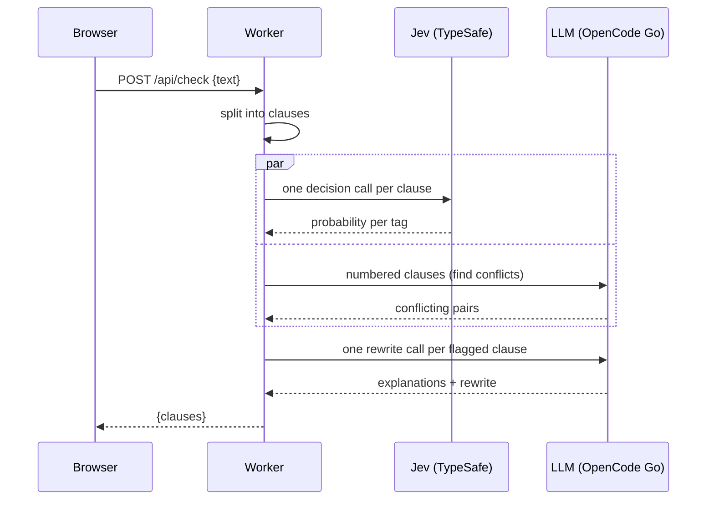

# SpecCheck

SpecCheck checks draft requirements from tenders and statements of work before they go to review. Paste a requirements section, click **Check Requirements**, and each clause is checked for five drafting flaws:

| Tag | Example |
|---|---|
| **Vague** | "The system shall be user-friendly." |
| **Untestable** | "The system shall provide fast response times." |
| **Vendor-locking** | "All laptops shall be Dell Latitude 7450." |
| **Conflicting** | "Retain logs for 12 months" vs "delete logs after 6 months" |
| **Compound** | "Back up nightly, restore within 4 hours, and train 20 administrators." |

Each flagged clause comes with a plain-English reason and a suggested rewrite. You can accept or edit each rewrite. **Copy All Cleaned** or **Download .txt** then gives you the whole cleaned spec, with your original numbering, to paste back into your draft.

Do not paste classified, restricted or sensitive information. Pasted text is sent to two model providers for checking: OpenCode Go (the LLM) and TypeSafe (Jev). SpecCheck itself stores nothing: no database, no browser storage, and the Worker never logs the pasted text.

## Landing page

`public/index.html` is the public landing page (served at `/`; the app itself is `public/app.html` at `/app`): problem statement, target user, outcome metric, riskiest assumption and eval evidence. It uses the brand icon and logos in `public/brand/`, and the product screenshot in `public/assets/`.

## Architecture

SpecCheck runs as a single Cloudflare Worker. The page in `public/` is served as static assets, and `POST /api/check` is handled by `src/index.js`:

1. `src/splitter.js` splits the pasted text into clauses. A new clause starts at a blank line, a bullet or a numbered label (`1.`, `3.2.1`, `(a)`, `REQ-012:`). Wrapped lines are joined back together, and headings are dropped.
2. `src/checker.js` checks the clauses in one of two ways, set by `CHECK_MODE`:
   - **`hybrid`** (the default, `src/hybrid.js`) runs one Jev call per clause (`src/jev.js`) in parallel with one LLM call over the whole list. Jev decides Vague, Untestable, Vendor-locking and Compound, and the LLM call finds Conflicting pairs. Then one small LLM call per flagged clause writes the explanations and the rewrite.
   - **`llm`** sends all the clauses in one model call.

   A hybrid check of N clauses makes up to 2N + 1 outbound requests (N Jev calls, 1 conflict call, and 1 rewrite per flagged clause). The Workers Free plan allows 50 per request, so long pastes need the Workers Paid plan (1,000). Workers also keep at most 6 connections open at once, so the calls queue in batches of 6.
3. `src/jev.js` calls Jev, TypeSafe's System One decision model, at `https://api.typesafe.ai/v1` (override with `JEV_AI_BASE_URL`). See `JEV_INTEGRATION.md`.
4. `src/llm.js` calls the OpenCode Go endpoint, which is OpenAI-compatible, with the model `deepseek-v4-flash`.
5. `src/prompts.js` holds the conflict and rewrite prompts for the hybrid checker, and the two candidate system prompts (`baseline` and `strict`). `ACTIVE_PROMPT` sets which one ships, and `SUPPRESSED_TAGS` can hide a tag that raises too many false alarms.



## Setup

1. Install dependencies:
   ```sh
   npm install
   ```
2. Create `.env` from `.env.example` and add both keys, `OPENCODE_API_KEY` (OpenCode Go) and `JEV_AI_API_KEY` (TypeSafe):
   ```sh
   cp .env.example .env
   ```
3. Start the dev server:
   ```sh
   npm run dev
   ```
   Open http://localhost:8788. The port is set in `wrangler.toml` so SpecCheck doesn't clash with other Workers on 8787.
4. To deploy, set both secrets on Cloudflare, then deploy:
   ```sh
   npx wrangler secret put OPENCODE_API_KEY
   npx wrangler secret put JEV_AI_API_KEY
   npm run deploy
   ```

Secrets never go in code or in `wrangler.toml`. `.env` is gitignored.

## Tests

```sh
npm test
```

This runs the unit tests with Node's built-in test runner. They mock `fetch`, so they make no network calls.

## Evaluation

`eval/dataset.json` holds 40 labelled requirements: 20 valid clauses written in the style of public ICT and facilities tenders, and 20 flawed clauses written by hand, 4 per tag. Clauses where a second tag is defensible list it under `also_ok`, and those tags aren't counted as false positives.

```sh
npm run eval                                   # both prompts, 3 runs each
npm run eval -- --runs 1 --prompts strict --model deepseek-v4-flash
```

The eval checks all 40 clauses as one document, the same way the app does. It reports clause-level recall and precision, per-tag scores, and every miss and false alarm. Results are saved to `eval/results/`. The target is ≥ 80% recall and ≥ 70% precision.

**Result: `strict` ships.** On `deepseek-v4-flash`, both prompts reached 95% recall and 100% precision, with no false alarms on the 20 valid clauses. `strict` assigned the right tag more often. `baseline` usually called untestable clauses "Vague", and it missed one side of a conflicting pair every time. It also timed out on 1 of 4 runs. A 40-clause check takes 52–260s, which is longer than the app's 60s model timeout, so keep pastes short. See [`eval/RESULTS.md`](eval/RESULTS.md) for per-tag scores and limitations.
