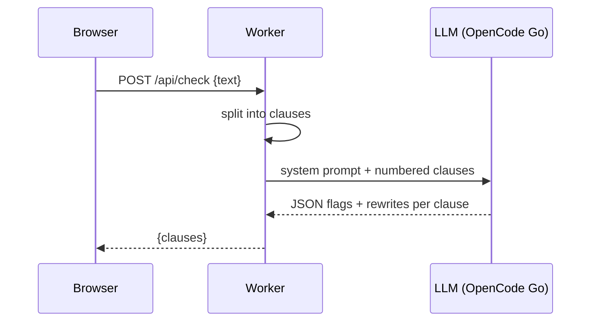

# SpecCheck

SpecCheck checks draft requirements from tenders and statements of work before they go to review. Paste a requirements section, click **Check Requirements**, and each clause is checked for five drafting flaws:

| Tag | Example |
|---|---|
| **Vague** | "The system shall be user-friendly." |
| **Untestable** | "The system shall provide fast response times." |
| **Vendor-locking** | "All laptops shall be Dell Latitude 7450." |
| **Conflicting** | "Retain logs for 12 months" vs "delete logs after 6 months" |
| **Compound** | "Back up nightly, restore within 4 hours, and train 20 administrators." |

Each flagged clause comes with a plain-English reason and a suggested rewrite. You can accept or edit each rewrite. **Copy All Cleaned** or **Download .txt** then gives you the whole cleaned spec, with your original numbering, to paste back into your draft.

Do not paste classified, restricted or sensitive information. Pasted text is sent to the LLM provider for checking. SpecCheck itself stores nothing: no database, no browser storage, and the Worker never logs the pasted text.

## Architecture

SpecCheck runs as a single Cloudflare Worker. The page in `public/` is served as static assets, and `POST /api/check` is handled by `src/index.js`:

1. `src/splitter.js` splits the pasted text into clauses. A new clause starts at a blank line, a bullet or a numbered label (`1.`, `3.2.1`, `(a)`, `REQ-012:`). Wrapped lines are joined back together, and headings are dropped.
2. `src/checker.js` sends all the clauses in **one** model call, so the model can see the whole list and spot Conflicting pairs. It then normalises the JSON reply.
3. `src/llm.js` calls the OpenCode Go endpoint, which is OpenAI-compatible, with the model `deepseek-v4-flash`.
4. `src/prompts.js` holds the two candidate system prompts (`baseline` and `strict`). `ACTIVE_PROMPT` sets which one ships, and `SUPPRESSED_TAGS` can hide a tag that raises too many false alarms.



## Setup

1. Install dependencies:
   ```sh
   npm install
   ```
2. Create `.env` from `.env.example` and add your OpenCode Go key:
   ```sh
   cp .env.example .env
   ```
3. Start the dev server:
   ```sh
   npm run dev
   ```
   Open http://localhost:8788. The port is set in `wrangler.toml` so SpecCheck doesn't clash with other Workers on 8787.
4. To deploy, set the secret on Cloudflare, then deploy:
   ```sh
   npx wrangler secret put OPENCODE_API_KEY
   npm run deploy
   ```

Secrets never go in code or in `wrangler.toml`. `.env` is gitignored.

## Tests

```sh
npm test
```

This runs the clause-splitter unit tests with Node's built-in test runner.

## Evaluation

`eval/dataset.json` holds 40 labelled requirements: 20 valid clauses written in the style of public ICT and facilities tenders, and 20 flawed clauses written by hand, 4 per tag. Clauses where a second tag is defensible list it under `also_ok`, and those tags aren't counted as false positives.

```sh
npm run eval                                   # both prompts, 3 runs each
npm run eval -- --runs 1 --prompts strict --model deepseek-v4-flash
```

The eval checks all 40 clauses as one document, the same way the app does. It reports clause-level recall and precision, per-tag scores, and every miss and false alarm. Results are saved to `eval/results/`. The target is ≥ 80% recall and ≥ 70% precision.

**Status: not yet run to completion.** In the first attempt, every 40-clause `kimi-k3` call ran past the 60-second limit, so there are no results yet. Eval runs now allow 5 minutes. The app currently ships the `strict` prompt, but no eval results support that choice yet. A shorter paste of 8 clauses takes about 10 seconds with `kimi-k3`. Long pastes may need a faster model to stay near the 10-second target.
